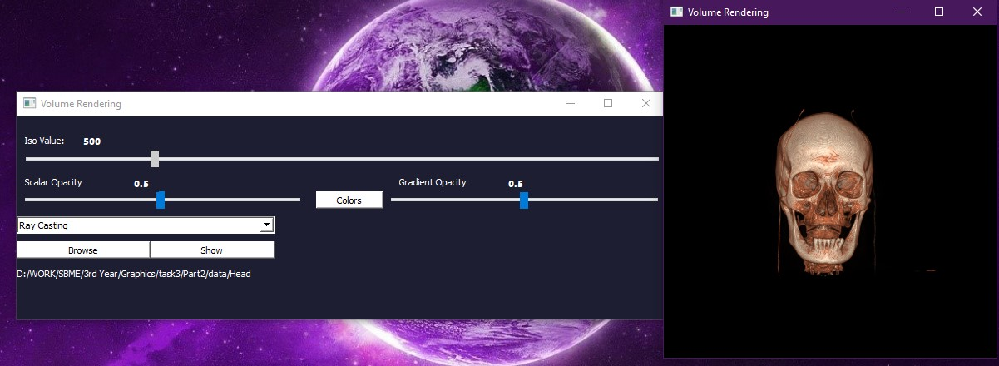
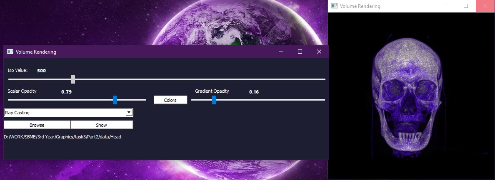
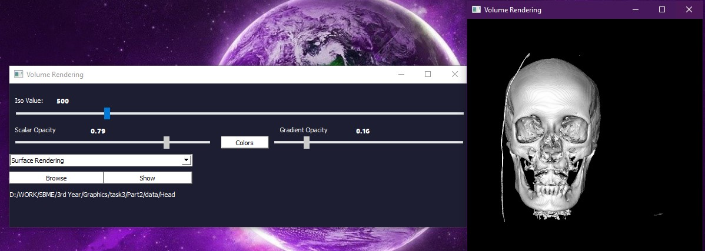
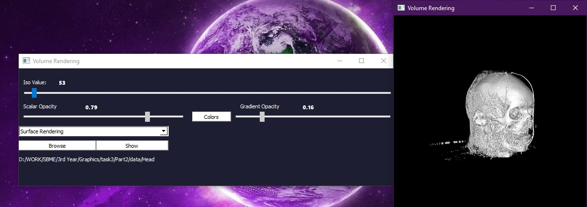

# Computer-Graphics
**Assignment 3**: Texture, Models & Medical Visualization <h1> 

## Table of Contents

-   [About the Project](#about-the-project)
-   [Changes in code](#changes-in-code)
-   [Issues encountered](#issues-encountered)
-   [Contribution of Others](#Contribution-of-Others)
-   [Members](#members)

##  About the Project

This project is divided into 2 parts.

**Part1:**

It's required to design two animations 
    * Using the robotic body, implemented in previous tasks, without interaction with any object.
    * The robotic body should interact with some loaded objects.

**Part2:**

It's required to build a volume rendering app with VTK & QT using datasets provided in data directory for Head and Ankle and `vtkDICOMImageReader` object.

##  Changes in code
** **

**Part1**:
#### Texture Mapping:
Three different types of texture is applied and can be changed, by right clicking on the scene, a drop menu shows having three different textures
   
#### Adding Objects:
Added to the Scene two objects: **Soccer Ball** and **Footbal Goal**
   
#### Animations:
Added 4 types of animations:
- Walking forward&backword
   hip, knee and shoulder joints are rotating and the coordinates of the body is increasing in the same direction of the moving body.
- Rotating and walking in any direction
   Applying the walking function after rotatin the body 90 degrees
- Jumping
   hip, knee and shoulder joints are rotating while the coordinates of the body is increasing upward
- Kicking the ball
   The right leg moves backward then forward kicking the ball, then the coordinates of the ball will change
   
#### Keyboard Shortcuts:
| Action                                       | Shortcut |
|----------------------------------------------|----------|
| Jumping                                      | Space    |
| Kick                                         | k        |
| Walking Forward                              | d        |
| Walking Backward                             | a        |
| Rotate the whole body in the left direction  | B        |
| Rotate the whole body in the right direction | b        |
   

**Part2**:

Creating GUI wasn't very challenging as we have past experience with QT. However, dealing with `VTK` came with a lot of struggles due to the lack of examples on their official website.

Class (`volRender`) was created to contain all methods required to show the model correctly. Some of these methods were implemented before by the TA so we basically read them and adjusted them to fit into our code. The class contains extra methods such as `warning_msg_generator()` to be used later to enhance the user experience.

First make sure all your files are put in one folder, then click on the button **Browse** to navigate in your computer and chooose that folder.

Click on **Show** to show the model after reading the data given in the directory.

Choosing `Ray Casting` method comes with a bonus advantage which is an adjustable transfer function that allows the user to change the color of the model shown.

In order to change the colors of the model, there's a button with label **Colors**. Clicking the button will open a pop-up window that contains all colors, user can pick any color and the changes will show on the model right after closing the pop-up window.

** **
**Images shown below are taken from our App, each with a title describing it**.

*Using Ray Casting with default slider values*
 

*Using Ray Casting again after changing scalar and gradient opacity values using the two sliders*
 

*Using Surface Rendering with ISO value=500*
 

*Using Surface Rendering with ISO value=53*

** **

##  Issues encountered  

**Part1**:

* We faced a problem in compiling the code from Visual Studio using Windows as it came up with `Compiler Error C2440` and we couldn't fix it 
   
   *SOLUTION:* we have worked on linux and macOs
   
* The animation functions were some how tricky at first 
   
   *SOLUTION:* Trial And Error :)

**Part2**:

* With the first run we faced some issues with showing the model as two windows were showing up, one with the model and the other one was like a control panel to change the view of that model.

    *SOLUTION:* After some tracing and debugging the issue found to be caused by adding the rendering window in a new `QVTKRenderWindowInteractor` not the one already used to show the model.

* After some modifications and with the second run we found that the widget doesn't update its contents although the slider values change correctly.

    *SOLUTION:* We added this line: ` self.ren.RemoveAllViewProps()` in the beginning of `ray_casting()` and `surface_render()`  in order to clear the widget and rewrite the new given data.
** **

##  Contribution of Others

* Our colleague 'Mo'men Maged' helped us with understanding how to deal with `VTK` object.

* 'Sheren Gamil' as well helped in the understanding of the bonus part (coloring the model).
   
** **

##  Members

* Name: **Hassan Fathi Shelkami**
Sec: 1  |   BN: 28

* Name: **Ammar Elsaeed Mohamed**
Sec: 1  |   BN: 51

* Name: **Mostafa Mohamed Essam**
Sec: 2  |   BN: 27

* Name: **Mostafa Mahmoud Abbas**
Sec: 2  |   BN: 28

* Name: **Yasser Nasser Ahmed**
Sec: 2  |   BN: 45
